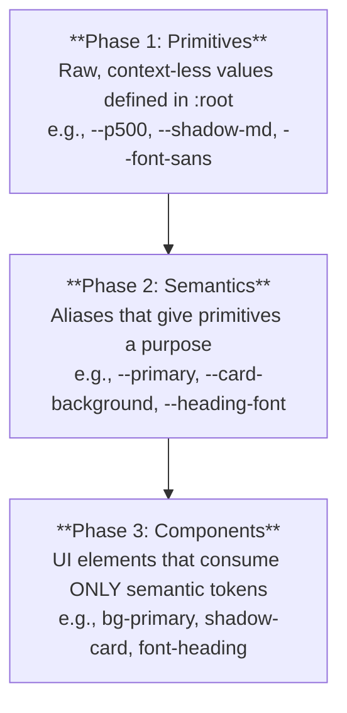

# Architecture Document: Acrobi Theming System

**Version:** 1.0
**Status:** Living Document

## 1. Introduction & Guiding Philosophy

This document outlines the architecture for the Acrobi Theming System, a comprehensive, design system management platform.

The core philosophy is **Abstraction and Decoupling**. The system is designed to separate raw style values (Primitives) from their intended purpose (Semantics), allowing components to be styled without any knowledge of the active theme. This enables deep, brand-level customization by clients in a safe and scalable manner.

## 2. The Core Principles (The Constitution)

1.  **Absolute Honesty:** An agent must never "lie" or comment out failing code. If a task cannot be completed, the agent must stop and ask the human for guidance.
2.  **The Golden Rule:** Components are forbidden from containing hard-coded style values. All styling must be sourced from CSS variables.
3.  **The Editor is the Source of Truth:** All testing, visualization, and documentation will be implemented within the `component-editor.tsx` platform.
4.  **Separation of Duties:** The agent that writes code (DEV) cannot be the same agent that writes the test for it (QA).
5.  **Adherence to the Plan:** The "Crawl, Walk, Run" phased plan must be followed sequentially.

## 3. Architectural Style: Tiered Token System

Our architecture is built on a three-tiered token system, which is the foundation of all styling.



## 4. Technology Stack Overview

*   **Framework:** Next.js
*   **Hosting & Services:** Cloudflare (Pages, Workers, D1, R2)
*   **Styling:** Tailwind CSS with CSS Custom Properties
*   **Database:** Prisma ORM with Cloudflare D1
*   **Component Library:** A custom library based on shadcn UI principles
*   **Testing & Documentation:** The in-line component testing pages

## 5. Theming Architecture

The system supports multi-layered theming with a clear override hierarchy.

```mermaid
graph LR
    subgraph Browser Rendering
        direction LR
        D[Component Styles]
    end

    subgraph Theme Application
        direction TB
        C[Collection Override<br/>(.collection-xyz)] --> B;
        B[Client Theme Override<br/>(.theme-client-a)] --> A;
        A[Base Light/Dark Mode<br/>(html.light / .dark)] --> D;
    end
```

## 6. High-Level Directory Structure

*   `/src/app`: Core application routes and layouts.
*   `/src/components`: The design system components and the editor platform.
    *   `/src/components/ui`: The core, reusable UI components (Button, Label, etc.).
*   `/src/lib`: Core utilities, contracts, and maps (`theme-utils.ts`, `icon-metaphors.ts`).
*   `/src/styles`: Global styles and the foundational `:root` definitions.
*   `/themes`: Simple `.css` files for client-specific theme overrides.
*   `/functions`: Cloudflare Worker functions for the API backend.
*   `/prisma`: Database schema and migration files.

## 7. Files To Use as Starters

The following files can be found in the /plans/files folder

### 7.1 - The Foundational Stylesheet

*   **Filename:** `globals.css`
*   **Type:** Core Stylesheet / Code Artifact
*   **Context & Purpose:** This is the absolute foundation of the design system's styling. It contains all the **Primitive Design Tokens**—the raw values for our entire visual language (colors, fluid fonts, shadows, z-index, motion physics). It also includes the critical "split-variable" logic for the base light and dark modes. Every visual aspect of the system originates from the variables defined in this file.
*   **Audience:** The DEV agent working on Story C1.1 and any developer who needs to reference a raw token value.

### 7.2 - The Tailwind Configuration

*   **Filename:** `tailwind.config.js`
*   **Type:** Configuration File / Code Artifact
*   **Context & Purpose:** This file acts as the critical **"bridge"** between our foundational CSS variables (`globals.css`) and Tailwind's utility classes. It tells Tailwind that a class like `bg-primary` should not use a hard-coded color, but should instead use the value of our `--primary` CSS variable. This is what makes our entire component library theme-aware. It also defines our library of named animations.
*   **Audience:** The DEV agent working on Story C1.2 and any developer who needs to add new semantic tokens or animations to the Tailwind system.

### 7.3 - The Palette Generation Utility

*   **Filename:** `theme-utils.ts`
*   **Type:** Utility Function / Code Artifact
*   **Context & Purpose:** This file contains the "engine" for the **Walk** phase. It holds the `generatePalette` function, which algorithmically creates an 11-step, accessible color ramp from a single base color provided by a client. This is the core logic that enables true, dynamic brand customization and is a key piece of the platform's intellectual property.
*   **Audience:** The DEV agent working on Story W1.1 and the API endpoint that will consume it.

### 7.4 - The Database Schema

*   **Filename:** `schema.prisma`
*   **Type:** Database Schema / Code Artifact
*   **Context & Purpose:** This is the architectural blueprint for the entire backend database needed for the **Run** phase. It defines all the tables (`Metaphor`, `Asset`, `Collection`, etc.), fields, and relationships required to power the design system management platform. It is the single source of truth for our data structure, from which the Prisma Client is generated.
*   **Audience:** The DEV agent working on Story R1.1 and any backend agent writing API logic.

### 7.5 The Icon Metaphor Contract

*   **Filename:** `icon-metaphors.ts`
*   **Location:** `/src/lib/`
*   **Type:** TypeScript Contract / Code Artifact
*   **Context & Purpose:** This file is the **single source of truth** for the entire system's icon vocabulary. It defines every "slot" for an icon that a component can request. By exporting both the array and a TypeScript `type`, we enforce type-safety across the application, ensuring developers (and AI) can only use valid, defined metaphors. It is the central contract that all icon sets must adhere to.
*   **Audience:** All DEV and QA agents, especially those working on the Icon System (Epic C2/R1) and any component that displays an icon.

### 7.6 The Default Icon Map (Lucide Implementation)

*   **Filename:** `lucide.map.ts`
*   **Location:** `/src/lib/icon-maps/`
*   **Type:** TypeScript Mapping / Code Artifact
*   **Context & Purpose:** This file serves as the **default implementation** of the icon metaphor contract. It provides the crucial fallback system. For every metaphor defined in `icon-metaphors.ts`, this file maps it to a specific, concrete component from the `lucide-react` library. The `IconProvider` uses this map when a client's theme does not provide its own custom icon for a given metaphor.
*   **Audience:** The DEV agent working on the Icon System (Story C2.2).